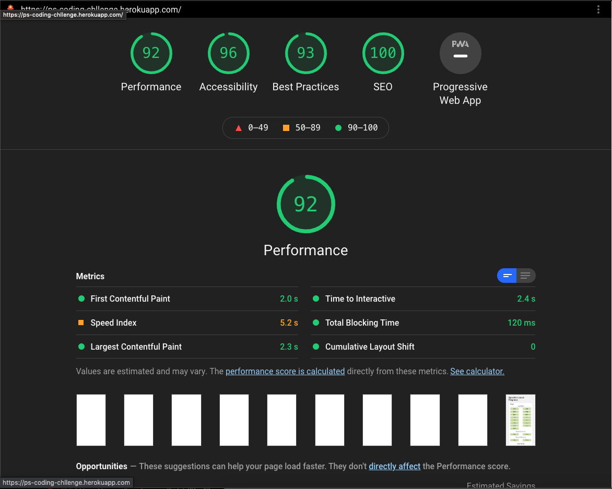

## Hosted @ Heroku

The project is hosted on heroku under the URL [ps-coding-challenge](https://github.com/thehaystacker/ps-coding-challenge) using CI pipeline

## Running the project

run the development server:

```bash
npm run dev
# or
yarn dev
```
## Running the Test cases

```bash
npm run test
```

pushing to heroku pipeline:

```bash
git push heroku master
```

Open [http://localhost:3000](http://localhost:3000) with your browser to see the result.

## Screenshot of Lighthouse report


